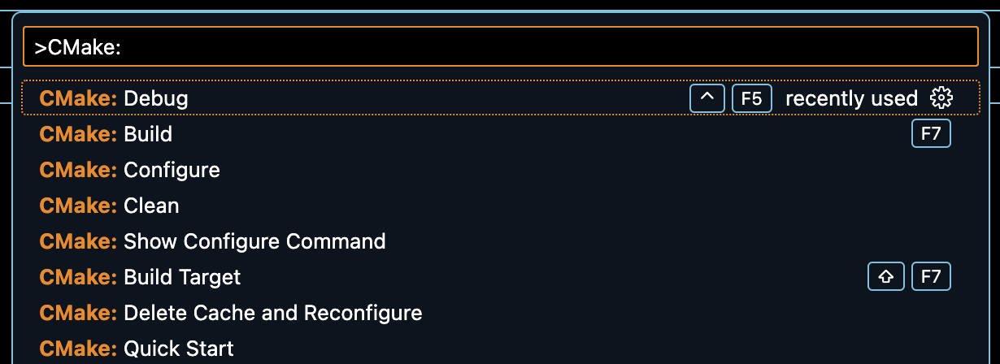
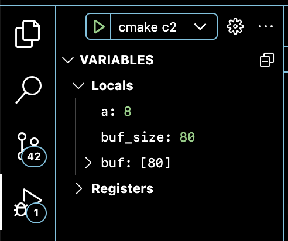

# Example of VSCode C++ CMake project

## Intro
This CMake project defines two executable targets - c2 and cmain.

## CMake cli workflow

### Configure
```
cmake --no-warn-unused-cli \
 -DCMAKE_EXPORT_COMPILE_COMMANDS:BOOL=TRUE \
 -DCMAKE_BUILD_TYPE:STRING=Debug \
 -DCMAKE_C_COMPILER:FILEPATH=/usr/bin/clang \
 -DCMAKE_CXX_COMPILER:FILEPATH=/usr/bin/clang++ \
 -Bbuild \
 -G Ninja
```

### Build (debug mode)
```
cmake --build build --config Debug --target all
```

### Clean
```
cmake --build build --target clean
```

## VSCode CMake tools workflow

### Configure and Build
Required VSCode Extensions:
- CMake
- CMake Tools

VSCode launching configs are listed in [.vscode/launch.json](.vscode/launch.json). They use [lldb-mi](https://github.com/lldb-tools/lldb-mi) which should be installed.

To run cmake commands in VSCode hit F1 (to Show Command Palette) and type
- CMake: Configure
- CMake: Build
- CMake: Clean
- CMake: Debug (Better to use Run and Debug and select particular launch Configuration. See below)



### Run And Debug

Select the "Run and Debug" icon in the Activity Bar on the side of VS Code.

On top of the Debug Console it will be Drop Down list with the predefined configurations from [.vscode/launch.json](.vscode/launch.json):

- c2
- cmain

Select one of the configurations and hit ▶.



Enjoy Debugging!
