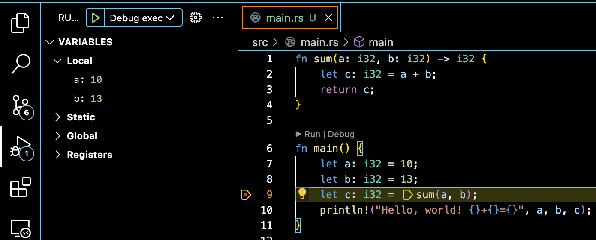

# Example project VSCode Rust

## Required VSCode Extensions
- rust-analyzer
- CodeLLDB

## Create project

```bash
cargo new rs1

cd rs1

cargo build

cargo run
```


## VSCode

Open the project folder is VSCode

Select the "Run and Debug" icon in the Activity Bar on the side of VS Code.

Click on blue link - create launch.json file

Command Palette should show LLDB - select it

The following dialog window will appear
```
Cargo.toml has been detected in this workspace.

Would you like to generate launch configurations for its targets?
```
Select Yes

This should generate [.vscode/launsh.json](.vscode/launsh.json) file with two configurations:
- Debug executable 'rs1'
- Debug unit tests in executable 'rs1'

Select one of the configurations in Debug Panel and hit ▶.



Enjoy Debugging!
